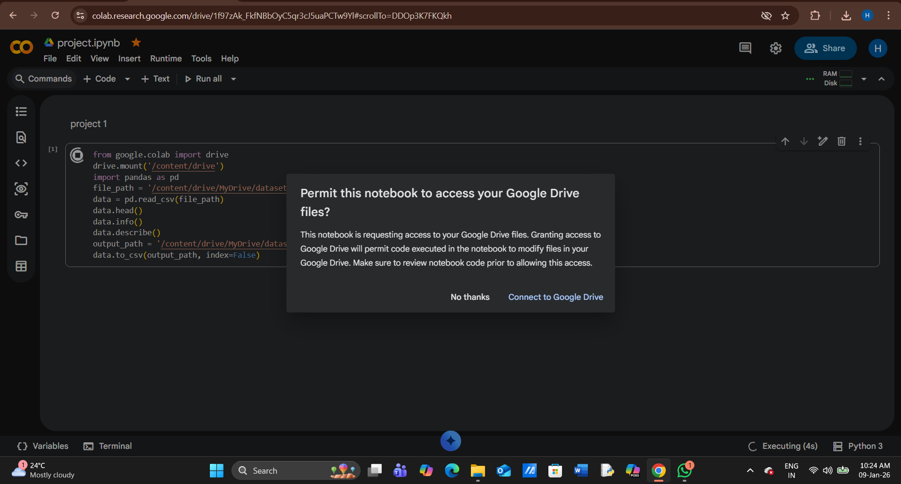
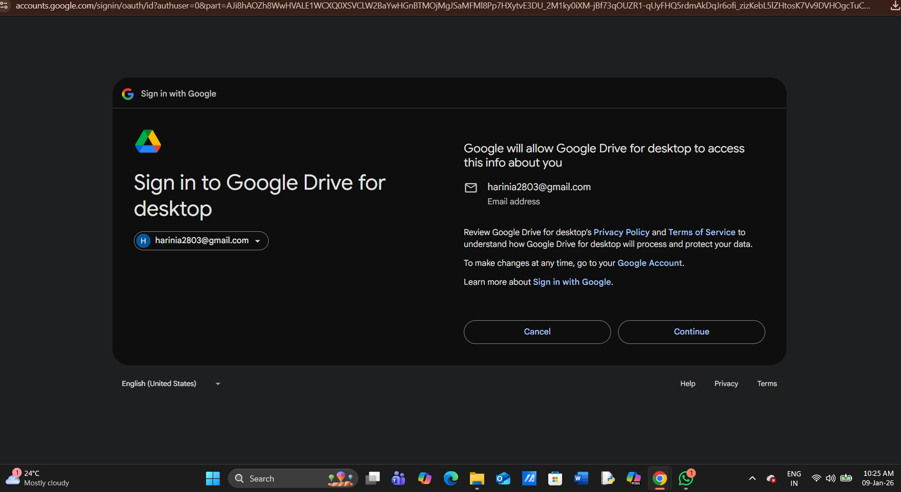
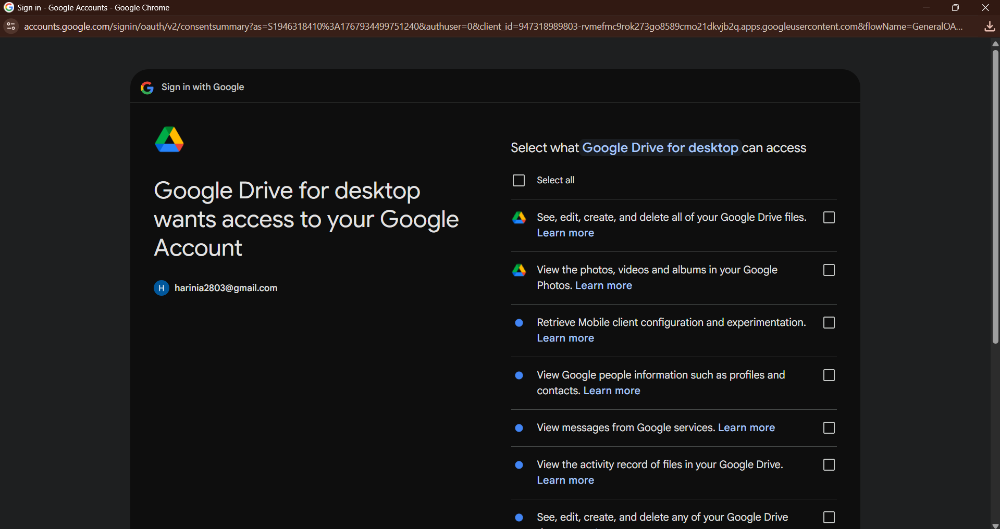
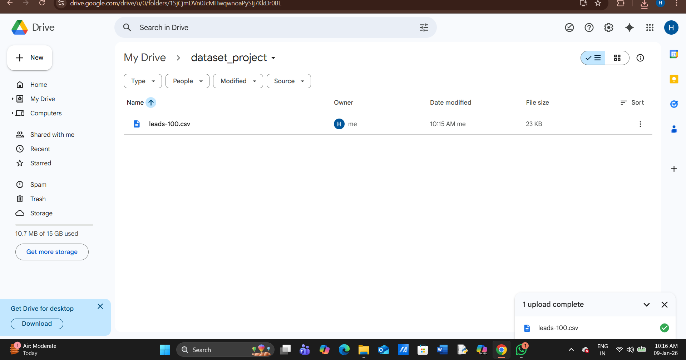
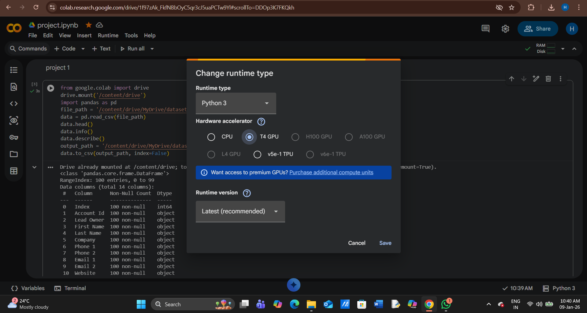

# ☁️ Cloud-Based Data Storage & Access

### 📌 Project Overview
This project focuses on automating data accessibility. I developed a Python-based workflow to bridge the gap between online datasets and cloud-based development environments.

### ⚙️ How it Works
1. **Data Acquisition:** Downloads datasets from online sources.
2. **Python Processing:** Uses a script in **Google Colab** to read and count records.
3. **Cloud Integration:** Connects with **Google Drive API** to ensure the data is saved and accessible across sessions.

### 🛠️ Skills Demonstrated
- **Python Scripting:** Handling file paths and basic data operations.
- **Cloud Connectivity:** Linking Google Colab with Google Drive storage.
- **Automation:** Reducing manual steps in data preparation.

### 🖼️ Execution Preview

**1. Authentication & Authorization**
Connecting to Google Drive API through Google Colab.

**2. Data Ingestion**
Preview of the dataset being accessed and processed by the Python script.

**3. Script Runtime & Output**
The Python script executing in Google Colab and generating the results.

**4. Cloud Persistence**
The final output successfully stored as a new file in Google Drive.

-
